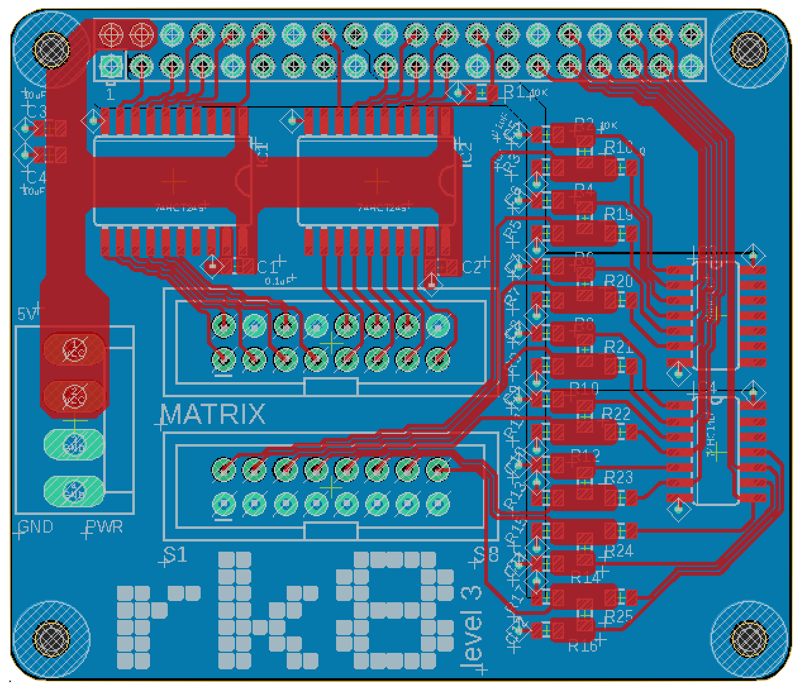
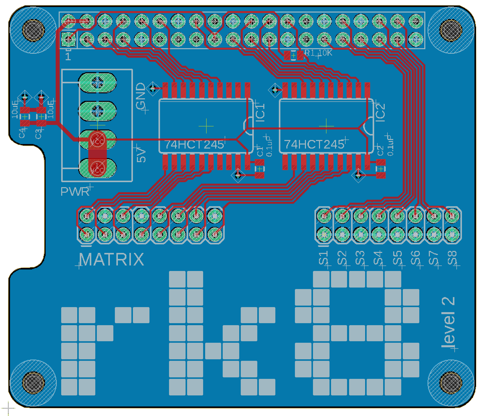

# RK8 - HAT

This repository contains Eagle based source files for constructing Raspberry Pi
HAT allowing to connect a 32x32 LED matrix and 8 switches (4 for a joystick) and
4 regular ones.

## Level 3

## Level 2

